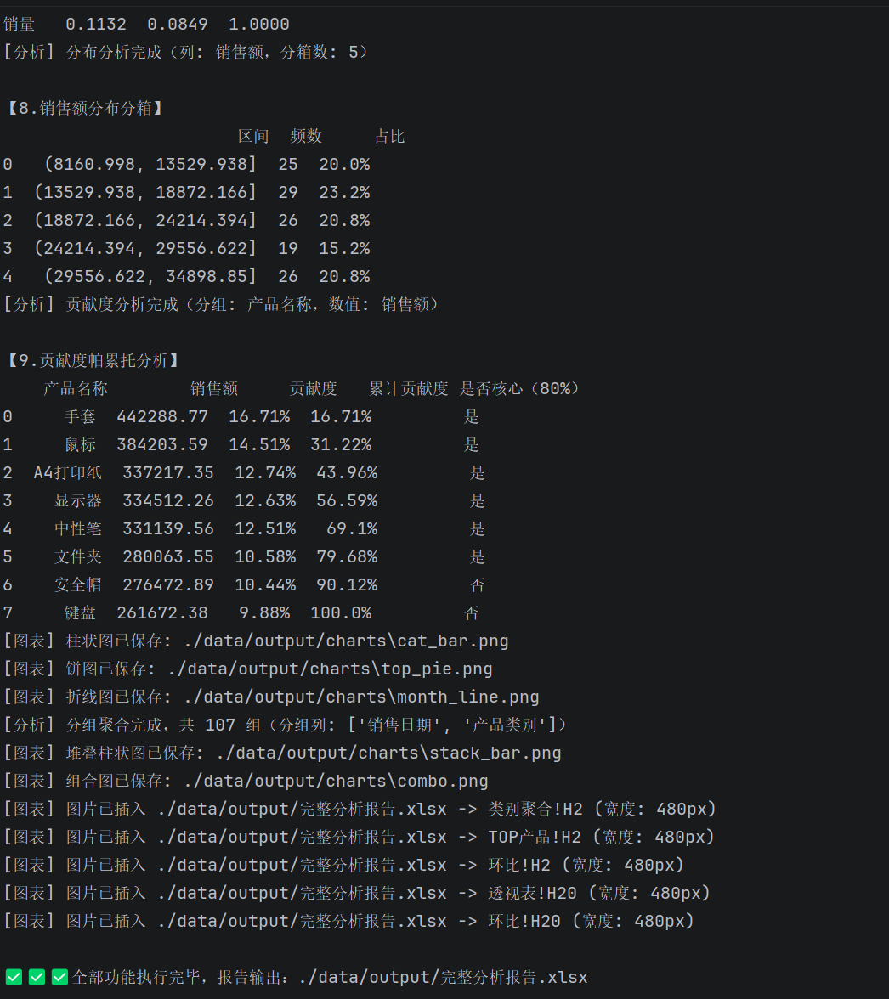
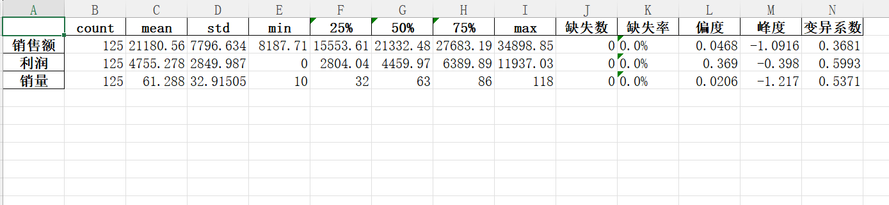

# Excel自动化数据处理工具
> Python实现批量Excel合并、数据清洗、统计分析、图表生成并嵌入Excel报告，用于办公批量数据ETL处理。

## 📂项目结构
excel_auto
├── data
│ ├── input # 放入待处理原始 Excel 文件
│ └── output # 输出合并后表格、分析报告、带图表的 Excel
├── src
│ ├── merger.py # 批量合并多个 Excel 文件
│ ├── cleaner.py # 数据清洗：去重、空值过滤、格式规整
│ ├── analyzer.py # 业务统计分析，生成统计指标
│ └── visualizer.py # 生成图表，将图表嵌入 Excel
├── main.py # 程序入口
├── run_all.py # 一键执行完整流水线
└── requirements.txt

## 📸 运行截图

### 待分析表

### 分析过程

### 分析结果

## 🛠技术栈
- Python3.10
- pandas：表格数据处理
- openpyxl：Excel读写、图表嵌入

## 🚀快速运行
1. 安装依赖
pip install -r requirements.txt

2. 将需要处理的 xlsx 文件放入data/input文件夹
3. 执行完整流水线
4. python test.py ->python main.py ->python run_all.py
5. 处理完成，结果在`data/output`目录

## 功能特性
批量合并：读取文件夹全部 xlsx，自动增加来源文件标记，合并为总数据表
数据清洗：去除重复行、过滤空数据、统一字段格式
数据分析：对合并后数据集做统计计算，输出汇总指标
可视化报告：生成统计图表，把图片嵌入输出 Excel，生成完整分析报告
